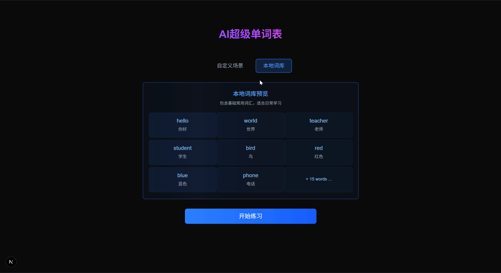

# AI超级单词表

**中文** | [English](README.en.md)

一款基于Next.js的沉浸式英语单词打字练习应用，通过AI生成个性化学习内容，让背单词更有趣更高效。

## 📺 应用预览

### AI场景练习模式
🎬 **演示视频**：[点击查看AI场景练习模式演示](https://github.com/user-attachments/assets/ai-scenairo-practice.mp4)

### 本地词库练习模式


## ✨ 核心功能

### 🎯 沉浸式打字练习背单词
- **专注打字体验**：纯净的界面设计，专注于打字练习
- **智能输入检测**：实时检测输入正确性，提供即时反馈
- **音效增强**：打字音效、正确/错误提示音，提升学习体验
- **自动发音**：每个单词自动播放标准发音，加强听觉记忆

### 📚 本地词库练习
- **精选常用词汇**：内置23个基础常用英语单词
- **快速开始**：无需配置，即开即用
- **打乱顺序**：每轮练习自动打乱单词顺序，避免记忆惯性

### 🤖 AI自定义场景练习
- **智能场景生成**：基于豆包AI，根据用户输入的场景生成相关词汇
- **场景推荐**：AI智能推荐热门学习场景（餐厅点餐、机场值机、酒店入住等）
- **灵活数量**：支持生成5-50个单词，满足不同学习需求
- **实时预览**：生成后可预览词汇内容，确认后开始练习

### ⌨️ 智能交互设计
- **键盘快捷键**：
  - `Alt + P`：暂停/继续游戏
  - `Alt + K`：显示/隐藏答案提示
  - `Alt + L`：跳转到下一个单词
- **智能提示**：连续错误3次自动显示答案提示
- **进度追踪**：实时显示练习进度和完成状态

## 🛠 技术栈

### 前端框架
- **Next.js 15.3.3** - 基于React的全栈框架，使用App Router
- **React 19.1.0** - 用户界面构建
- **TypeScript 5** - 类型安全的JavaScript

### UI与样式
- **Tailwind CSS 4** - 实用优先的CSS框架
- **Heroicons** - 美观的SVG图标集

### AI与音频
- **OpenAI SDK** - 集成豆包AI API进行词汇生成
- **use-sound** - React音频播放hook

### 开发工具
- **ESLint** - 代码质量检查
- **PostCSS** - CSS处理工具

## 🚀 快速开始

### 环境要求
- Node.js 18+ 
- pnpm (推荐) 或 npm

### 安装与运行

1. **克隆项目**
```bash
git clone [repository-url]
cd julebu-nextjs-clone-core
```

2. **安装依赖**
```bash
pnpm install
```

3. **启动开发服务器**
```bash
pnpm dev
```

4. **访问应用**
打开浏览器访问 [http://localhost:3000](http://localhost:3000)

### 构建部署

```bash
# 构建生产版本
pnpm build

# 启动生产服务器
pnpm start

# 代码检查
pnpm lint
```

## 📖 使用指南

### 开始练习
1. 选择练习模式：
   - **本地词库**：使用内置词汇快速开始
   - **自定义场景**：输入场景描述，AI生成相关词汇

2. 开始打字练习：
   - 看到中文释义，输入对应的英文单词
   - 系统会自动播放单词发音
   - 输入正确后自动进入下一个单词

3. 使用快捷键提升效率：
   - 忘记单词时按 `Alt + K` 显示答案
   - 需要暂停时按 `Alt + P`
   - 想跳过当前单词按 `Alt + L`

### AI场景定制
1. 在自定义场景页面输入主题，如：
   - "餐厅点餐"
   - "求职面试"
   - "旅行英语"
   - "购物交流"

2. 选择词汇数量（5-50个）

3. 点击"生成词库"，AI将创建相关词汇

4. 预览生成的词汇，满意后开始练习

## 🎯 项目特色

- **🎮 游戏化学习**：通过打字游戏的方式让背单词变得有趣
- **🎵 多感官体验**：视觉、听觉、触觉多重刺激加强记忆
- **🧠 AI驱动**：智能生成个性化学习内容
- **⚡ 高性能**：基于Next.js的现代化架构，响应快速
- **📱 响应式设计**：完美适配桌面和移动设备
- **🎨 简洁美观**：专注学习体验的界面设计

## 📁 项目结构

```
src/
├── app/                    # Next.js App Router
│   ├── api/               # API路由
│   └── page.tsx           # 主页面
├── components/            # React组件
│   ├── Game.tsx          # 游戏主组件
│   ├── DictionarySelector.tsx  # 词库选择器
│   ├── Input.tsx         # 输入组件
│   └── ...               # 其他UI组件
├── data/                 # 数据文件
│   └── words.ts          # 本地词库
├── services/             # 服务层
│   └── openai.ts         # AI服务
├── types/                # TypeScript类型定义
└── hooks/                # React Hooks
```

## 🤝 贡献指南

欢迎提交Issues和Pull Requests！

## 📄 许可证

本项目采用 MIT 许可证。
